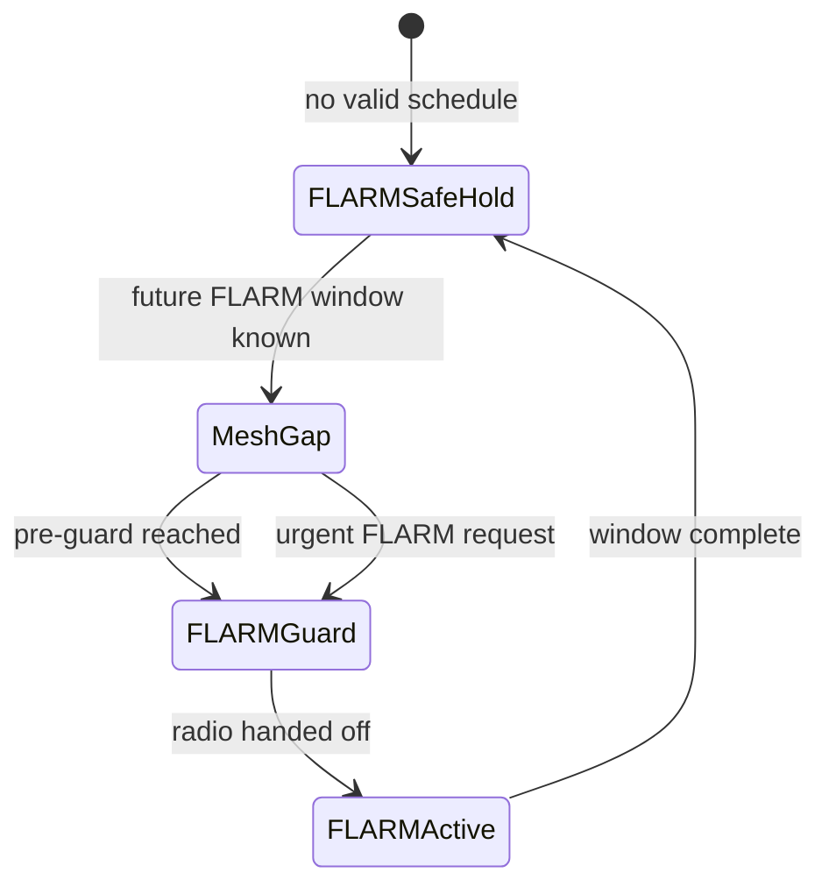

# BONK vNext architecture

## One physical radio, one safety rule

The first reference target is an ESP32-S3-class controller with an SX126x-class
LoRa radio. FLARM and Meshtastic therefore cannot touch the radio concurrently.
`RadioArbiter` is the sole authority allowed to grant radio time.

| Client | Priority | Lease behavior |
|---|---:|---|
| FLARM | Absolute | May revoke any mesh lease immediately. |
| Meshtastic TX | Background | Granted only when the entire calculated packet airtime fits. |
| Meshtastic RX | Background | Clipped to the configured maximum and next FLARM guard. |

The arbiter protects a FLARM interval with both a pre-guard and post-guard. A
radio handoff allowance is included so the hardware adapter can stop the mesh
stack, clear IRQ state, retune, and settle before the FLARM deadline.

The embedded scheduler must publish the next future FLARM window before mesh is
allowed to resume. A stale or missing schedule fails safe by withholding mesh.

## Portable core

The code in `include/bonk` and `src` has no Arduino, ESP-IDF, FreeRTOS, radio,
display, BLE, or heap dependency. This is intentional: safety invariants can be
tested on every commit and reused by either an Arduino or ESP-IDF adapter.

### Radio path

1. The FLARM scheduler publishes its next reserved interval.
2. Meshtastic proposes a receive dwell or complete transmit plan.
3. `MeshtasticGate` calculates worst-case LoRa airtime and asks the arbiter.
4. The hardware adapter waits until `not_before_us`, owns the radio until
   `expires_at_us`, and releases early when possible.
5. Any FLARM request revokes mesh. The adapter must make cancellation of the
   active mesh operation synchronous before starting FLARM radio work.

Lease tokens prevent a late completion callback from releasing a newer owner's
lease.

### BLE path

`BleTxMux` preserves the AirWhere-style FLARM serial UUIDs:

- Service: `0xFFE0`
- Characteristic: `0xFFE1`

FLARM telemetry is always dequeued before mesh data. If the FLARM queue fills,
the oldest telemetry frame is discarded so connected instruments receive the
freshest state. If the mesh queue fills, new mesh frames are rejected.

On ESP32-S3, both logical channels should live on one NimBLE server. BLE
connection housekeeping must continue even while mesh payload delivery is
deferred; the mux controls application egress priority, not the BLE controller.

### Boot display

`makeSplashFrame` provides display-independent product, status, and progress
text. The ESP32-S3 display adapter is responsible for layout and rendering. A
safe-hold or radio fault must remain visually distinct from a ready state.

## Failure policy

| Condition | Required result |
|---|---|
| FLARM asks for radio while mesh is active | Revoke mesh and grant FLARM. |
| Meshtastic packet cannot finish before guard | Reject TX; never truncate it. |
| FLARM window is unknown or stale | Deny mesh. |
| Monotonic clock moves backward | Revoke mesh and enter safe hold. |
| Mesh is disabled | Revoke its lease and reject new work. |
| FLARM telemetry queue is full | Drop oldest telemetry, retain newest. |

## Concurrency contract

The portable objects are intentionally not internally locked. Embedded adapters
must serialize all calls through one high-priority radio-control task or guard
them with a critical section. Radio IRQ callbacks should enqueue events to that
task rather than mutating the arbiter directly.
